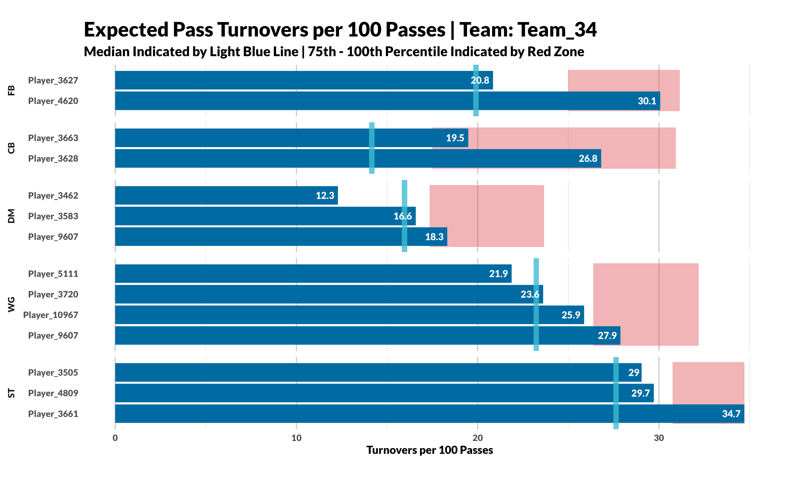
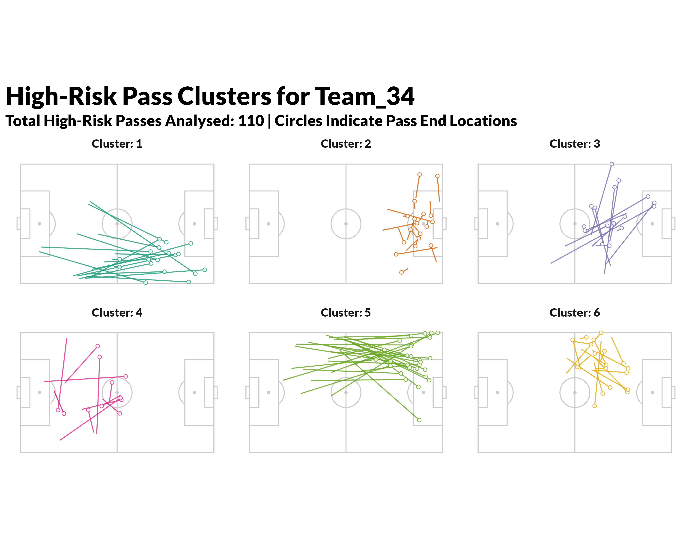

[](LICENSE)
[](https://doi.org/10.1080/02640414.2024.2379697)
[](sample_data.csv)
[](turnover_model_results_20251114_155537)
[](XTurnoverPlotting)

# xTurnover: Expected Turnover Model for Football Pass Analysis

A machine learning pipeline that predicts the probability of
turnovers in football passes using mixed-effects logistic regression
with cross-validation. This implementation is based on the methodology
published in the *Journal of Sports Sciences* and provides an automated
system for calculating Expected Pass Turnover (xTurnover) metrics in football
analytics.

**"Predicting turnovers in football using spatial and contextual data: An expected turnover model"**
*Journal of Sports Sciences*, 2024
DOI: 10.1080/02640414.2024.2379697

🔗 [Link to Paper](https://www.tandfonline.com/doi/full/10.1080/02640414.2024.2379697)

## Data Requirements

**Ensure your dataset contains all required variables**. Feature preprocessing is required for positional, spatial, and contextual metrics.  

### Required Features

| Category | Variables |
|----------|-----------|
| Basic Event Data | `turnover_count`, `player.name`, `match_id`, `position_group` |
| Spatial Features | `x`, `y`, `x_end`, `y_end`, `distance_ball_moved`, `ball_movement_speed`, `percent_distance`, `pass.angle` |
| Contextual Features | `play_pattern.name`, `pass.type.name` |
| Pressing Features | `pressing_count_1`, `pressing_count_2`, `pressing_count_3` |
| Teammate Orientation | `right_option`, `front_option`, `left_option`, `back_option` |
| Metadata Variables | `team.name`, `x_end`, `y_end` |

### Feature Explanation
| Variable                                                     | Feature                                                         | Definition                                                                                                  | Type       | Unit                                                                                          |
| ------------------------------------------------------------ | --------------------------------------------------------------- | ----------------------------------------------------------------------------------------------------------- | ---------- | --------------------------------------------------------------------------------------------- |
| `x`                                                          | Ball Carrier X Co-ordinate                                      | The x co-ordinate of the pass origin.                                                                       | Event      | Geometric Co-Ordinates |
| `y`                                                          | Ball Carrier Y Co-ordinate                                      | The y co-ordinate of the pass origin.                                                                       | Event      | Geometric Co-Ordinates |
| `ball_movement_speed`                                        | Ball Movement Speed                                             | The speed of the pass, taken as the distance travelled divided by the time taken to get to its destination. | Event      | Metres per second (m/s)                                                                       |                                                                              |
| `distance_ball_moved`                                        | Distance Ball Moved                                             | The distance in metres that the ball moved.                                                                 | Event      | Metres (m)                                                                                    |
| `pass.angle`                                                 | Pass Angle                                                      | The angle in radians of the pass…                                                                           | Event      | Radians (rad)                                                                                 |
| `pass.type.name`                                             | Pass Type Name                                                  | Passes were labelled to be…                                                                                 | Event      | Name                                                                                          |
| `percent_distance`                                           | Percentage Increase in Distance Towards Goal (Ball Progression) | The percentage increase in distance the ball moved…                                                         | Event      | Percentage (%)                                                                                |
| `play_pattern.name`                                          | Play Pattern Name                                               | The phase of play relevant to the pass event…                                                               | Event      | Name                                                                                          |
| `pressing_count_1`, `pressing_count_2`, `pressing_count_3`   | Three Pressure Radii                                            | The number of opposition players…                                                                           | Positional | Count (n)                                                                                     |
| `right_option`, `front_option`, `left_option`, `back_option` | Unmarked Teammates                                              | Teammates unmarked within 2 metres in four directions.                                                      | Positional | Binary (1/0)                                                                                  |


### Additional Metadata Features Required for Subsequent Plotting
| Variable    | Feature             | Definition                                  | Type  | Unit                   |
| ----------- | ------------------- | ------------------------------------------- | ----- | ---------------------- |
| `team.name` | Team Name           | The name of the possession team             | Event | Name                   |
| `x_end`     | Pass X End Location | The x co-ordinate of the pass end location. | Event | Geometric Co-Ordinates |
| `y_end`     | Pass Y End Location | The y co-ordinate of the pass end location. | Event | Geometric Co-Ordinates |


**Note:** For the co-ordinates of x & y variables, *Statsbomb* pitches are between 0 - 120 for x and between 0 - 80 for y.

Sample dataset has been randomly generated and anonymised: [sample_data.csv](sample_data.csv)

Sample output folder: [turnover_model_results_20251114_155537/](turnover_model_results)

## 🔧 Data Preprocessing Requirements

### Step 1: Positional Data Processing

* Calculate pressing variables (radii)
* Calculate orientation variables (directional quadrant availability)

👉 [Positional Feature Engineering](docs/positional_features.md)


This ensures reproducibility and matches the feature-engineering approach described by *Peters et al.* in the original *Expected Pass Turnovers* research.

### Step 2: Data Validation

R required columns check:

```
required_columns <- c(
  "turnover_count", "x", "y", "distance_ball_moved", "ball_movement_speed",
  "percent_distance", "pass.angle", "pressing_count_1", "pressing_count_2", 
  "pressing_count_3", "play_pattern.name", "pass.type.name",
  "right_option", "front_option", "left_option", "back_option",
  "player.name", "match_id", "position_group" ,"position_group", 
  "team.name" , "x_end", "y_end"
)
```

## 🚀 Quick Start

### Prerequisites

```
install.packages(c("lme4", "dplyr", "pROC"))
```

### Command Line Execution

```
chmod +x run_turnover_model.sh
./run_turnover_model.sh your_prepared_data.csv
```

### R Interactive Usage

```
source("cross_validate_turnover_model.R")
data <- read.csv("your_prepared_data.csv")
cv_results <- cross_validate_turnover_model(
  data = data,
  outcome_var = "turnover_count",
  k_folds = 5,
  seed = 123,
  verbose = TRUE
)
```

## 📁 Generated Outputs

* `dataset_with_xTurnover.csv`
* `model_summary_statistics.csv`
* `fold_details.csv`
* `confusion_matrix.csv`
* `all_predictions.csv`
* `model_report.txt`
* `complete_cv_results.rds`

---

# 🔍 Example Research Workflow

## 1. **Data Preparation**

Ensure your dataset meets the paper's specifications and includes all
required preprocessing (pressing, orientation, spatial features).

---

## 2. **Model Execution**

```bash
./run_turnover_model.sh your_sample_data.csv
```

---

## 3. **Results Analysis**

* Review `model_report.txt` for performance summary.
* Analyze `dataset_with_xTurnover.csv` for insights.
* Use statistical tests to validate empirical findings.

---

## 4. **Research Extension (R Example)**

```r
# Load results for further analysis
results <- readRDS("complete_cv_results.rds")

# Analyze player-specific patterns
player_analysis <- results$xTurnover_dataset %>%
  group_by(player.name) %>%
  summarise(
    avg_xTurnover = mean(xTurnover, na.rm = TRUE),
    actual_turnover_rate = mean(turnover_count),
    decision_quality = actual_turnover_rate - avg_xTurnover
  )
```

---

## 🧰 XTurnoverPlotting R Package

The `XTurnoverPlotting` R package wraps the core analysis scripts into reusable functions:

* `compute_turnover_plot()`: Compute and visualise expected turnovers per 100 passes by team and position.
* `analyse_high_risk_passes()`: Identify, cluster, and plot high-risk passes for a team using k-means.

### Installation

```r
install.packages("devtools")
devtools::install_github("andypetes94/ExpectedPassTurnovers/XTurnoverPlotting")
```

### 🛠 Example Usage

#### 1️⃣ Team Turnover Plot

```r
library(XTurnoverPlotting)

# Example: plot expected turnovers for Team_34
result_plot <- compute_turnover_plot(
  data = your_prepared_data,
  team_name = "Team_34",
  min_passes = 30
)

print(result_plot)
```



#### 2️⃣ High-Risk Pass Clustering

```r
library(XTurnoverPlotting)

result <- analyse_high_risk_passes(
  data = your_prepared_data,
  team = "Team_34",
  data_provider = "statsbomb",
  risk_column = "risk_category",
  cluster_count = 6
)

print(result$plot)
head(result$cluster_data)
```



### 3️⃣ Team xTurnover Grid Plot

``` r
library(XTurnoverPlotting)

# Example: plot average xTurnover per grid cell with performance coloring
grid_plot <- plot_team_turnover_grid(
  data = your_prepared_data,
  x_max = 72,          # plot the first 60% of the pitch (default)
  n_x_bins = 2,        # number of vertical bins
  n_y_bins = 3,        # number of horizontal bins
  title = "Team xTurnover Grid",
  subtitle = "Green = Positive (Low Turnover) | Red = Negative (High Turnover) | Yellow = Neutral"
)

print(grid_plot)
```


#### Higher‑resolution grid

``` r
plot_team_turnover_grid(your_prepared_data, n_x_bins = 4, n_y_bins = 6)
```

#### Full‑pitch grid (0--120m)

``` r
plot_team_turnover_grid(your_prepared_data, x_max = 120, n_x_bins = 4, n_y_bins = 4)
```

#### Custom 3×3 grid in the attacking third

``` r
plot_team_turnover_grid(your_prepared_data, x_max = 40, n_x_bins = 3, n_y_bins = 3)
```

---

### 📁 Output

- `compute_turnover_plot()` → ggplot2 object  
- `analyse_high_risk_passes()` → list: `plot`, `cluster_data`, `kmeans_result`
- `plot_team_turnover_grid` → ggplot2 object  

---

### Dependencies

* dplyr
* ggplot2
* ggsoccer

Ensure these packages are installed before using `XTurnoverPlotting`.

---

# 📚 Citation

### **If using the methodology, cite:**

```
@article{xTurnover2024,
  title={Predicting turnovers in football using spatial and contextual data: An expected turnover model},
  author={[Andrew Peters, Nimai Parmar, Michael Davies, Matt Reeves, Mladen Sormaz, Nic James]},
  journal={Journal of Sports Sciences},
  year={2024},
  doi={10.1080/02640414.2024.2379697},
  url={https://www.tandfonline.com/doi/epdf/10.1080/02640414.2024.2379697}
}
```

### **If using the software implementation, cite:**

```
@software{xTurnover_implementation,
  title={xTurnover: Expected Turnover Model Implementation},
  author={[Andrew Peters]},
  year={2025},
  url={https://github.com/andypetes94/ExpectedPassTurnovers/},
  note={Implementation of methodology from Journal of Sports Sciences}
}
```