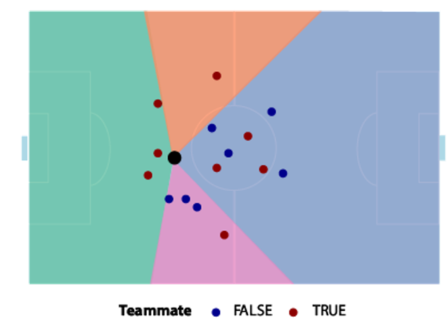
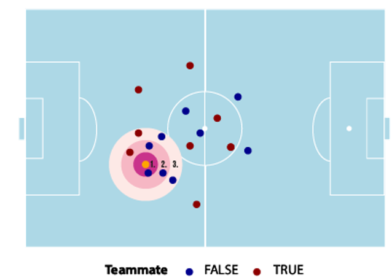

# Positional Feature Engineering

**Data Source:** StatsBomb 360 freeze-frames from the 2020/21 Premier League season (StatsBomb, 2022).  
The positional dataset contained multiple rows per event freeze-frame.  
Following Peters et al., two categories of positional features were derived: **directional unmarked-teammate options** and **pressure-radius counts**.

## Directional Unmarked Teammate Features

1. Coordinates were rescaled to meters relative to each team’s pitch dimensions.  
2. Minimum distances between each possession-team player and each defender were computed.  
3. A teammate was labelled **marked** if within **2 meters** of an opposing player.  
4. Teammates were assigned to four angular sectors relative to the ball carrier’s orientation:
   - Left (–100° to –45°)  
   - Right (45° to 100°)  
   - Front (–45° to 45°)  
   - Behind (remaining angles)

For each sector, a binary indicator was created representing whether at least one **unmarked teammate** was available.

## Pressure-Radius Features

Pressure radii were adjusted based on distance to the opposition goal:

- If **>24 m** from goal → base radius = **4.5 m**  
- If **≤24 m** → base radius =  
  `distance_to_goal × 0.15 + 0.85`

Three radii were generated:
- 0.5 × base radius  
- 1 × base radius  
- 2 × base radius  

For each radius, the number of opponents within the area was counted.

## Final Variables

| Category | Variables |
|---------|-----------|
| Unmarked teammate indicators | `left_option`, `right_option`, `front_option`, `back_option` |
| Pressure radii counts | `pressing_count_1`, `pressing_count_2`, `pressing_count_3` |
| Join key | `event_id` |

The positional dataset was then left-joined with event data via event ID.
